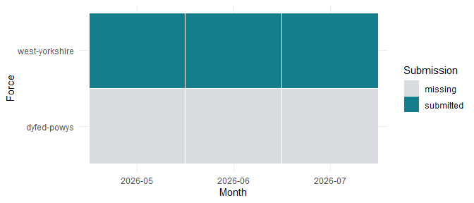

# From archive to audited dataset

This walkthrough is precomputed from bundled public data. Viewing it,
running installed examples and checking the package require no internet
connection. The source archive describes search **events**, not unique
people.

## Acquire a snapshot, then choose whole files

The archive is the unit of acquisition. A rolling monthly ZIP may
contain years of files. A later archive can revise an earlier
force-month. Searchlight records both publisher MD5 verification and a
local SHA-256 integrity manifest. The latter detects later changes; it
is not a publisher signature.

The following acquisition code is displayed but never run during a
package check:

``` r

cache <- sl_cache_dir()
months <- c("2026-05", "2026-06", "2026-07")
forces <- c("west-yorkshire", "dyfed-powys")
sl_archive_download(months, forces = forces, dir = cache)
versions <- sl_archive_snapshot(cache, months = months, forces = forces)
versions <- sl_select_version(versions, rule = "latest")
records <- sl_read_records(cache, versions)
```

No function deduplicates individual searches across archive versions. It
selects one entire CSV per force-month and retains the alternatives.
Even identical event rows can represent distinct reported searches.
Original CSV bytes remain intact.

The bundled sample permits the same selection and parsing steps offline:

``` r

sample_dir <- data_file("sample")
versions <- sl_select_version(sl_list_versions(sample_dir))
knitr::kable(versions[c("force_id", "month", "n_records", "selection_rule")])
```

| force_id       | month   | n_records | selection_rule |
|:---------------|:--------|----------:|:---------------|
| west-yorkshire | 2026-05 |      1659 | latest         |
| west-yorkshire | 2026-06 |      1466 | latest         |
| west-yorkshire | 2026-07 |      1532 | latest         |

``` r

parsed <- sl_read_records(sample_dir, versions[1, ])
knitr::kable(summary(sl_contract(parsed))[c("force_id", "month", "status", "n_records")])
```

| force_id       | month   | status    | n_records |
|:---------------|:--------|:----------|----------:|
| west-yorkshire | 2026-05 | submitted |      1659 |
| dyfed-powys    | 2026-05 | missing   |        NA |
| west-yorkshire | 2026-06 | missing   |        NA |
| dyfed-powys    | 2026-06 | missing   |        NA |
| west-yorkshire | 2026-07 | missing   |        NA |
| dyfed-powys    | 2026-07 | missing   |        NA |

The filename defines the submission month. Parsed instants display
London time, including British summer time. Conversion of a late-month
UTC timestamp can cross into the next calendar month; this is flagged
without moving it to a different source submission. Raw timestamp and
ethnicity strings remain available.

## Coverage comes before comparison

The requested sample is May-July 2026 for West Yorkshire and
Dyfed-Powys. The latter has no source file in these three months; it
remains in the audit.

``` r

coverage <- sl_coverage(x)
knitr::kable(coverage[c("force_id", "month", "status", "n_records")])
```

| force_id       | month   | status    | n_records |
|:---------------|:--------|:----------|----------:|
| dyfed-powys    | 2026-05 | missing   |        NA |
| dyfed-powys    | 2026-06 | missing   |        NA |
| dyfed-powys    | 2026-07 | missing   |        NA |
| west-yorkshire | 2026-05 | submitted |      1659 |
| west-yorkshire | 2026-06 | submitted |      1466 |
| west-yorkshire | 2026-07 | submitted |      1532 |

``` r

plot(coverage)
```



plot of chunk coverage

Missing is unavailable, not zero. A submitted zero-row file is
distinguishable from an absent file. A suspected partial submission
remains flagged, and reported events are not inflated to estimate the
missing events. Revisions describe whole-file changes and never trigger
row-level deduplication.

Filtering events preserves source coverage. The contract’s scope records
the visible rows; rates must explicitly select the force/month analysis
window.

``` r

subset <- x[x$ethnicity_5 == "Black", ]
c(source_events = nrow(x), visible_black_events = nrow(subset),
  source_force_months = nrow(sl_contract(subset)$coverage))
#>        source_events visible_black_events  source_force_months
#>                 4657                   58                    6
```

## Attach geography locally

After download, coordinates can be joined to any suitable ONS boundary
without reacquiring events. Searchlight uses British National Grid for
spatial assignment and distances. It reuses exact coordinate
calculations while preserving every event and its contribution to
quality summaries.

``` r

knitr::kable(sl_contract(x)$assignment_quality, digits = 3)
```

| type | missing_coordinate_share | unassigned_share | boundary_sensitive_share | ambiguous_share | threshold_m |
|:---|---:|---:|---:|---:|---:|
| lsoa21 | 0.035 | 0.038 | 0.493 | 0 | 50 |
| msoa21 | 0.035 | 0.038 | 0.244 | 0 | 50 |

These are anonymised street-level snap points. Near-boundary locations
can be systematically misassigned; distance is a sensitivity diagnostic,
not a correction. Records without coordinates remain unassigned and are
counted. Shared-edge ties use the first geography code and remain
flagged as ambiguous. The boundary-sensitive share uses assigned events
with measured distances; missing-coordinate and unassigned shares use
all supplied events.

The sample uses original ONS BGC polygons for assignment and separately
simplified polygons for compact mapping. It retains whole Census units
within the two force areas, so a clipped fragment never receives an
entire unit’s population.

## Inspect timestamp quality and exposures

``` r

times <- sl_timestamp_quality(x)
knitr::kable(times[c("force_id", "month", "source_midnight_share",
  "midnight_share", "time_reliable")], digits = 3)
```

| force_id       | month   | source_midnight_share | midnight_share | time_reliable |
|:---------------|:--------|----------------------:|---------------:|:--------------|
| dyfed-powys    | 2026-05 |                    NA |             NA | FALSE         |
| dyfed-powys    | 2026-06 |                    NA |             NA | FALSE         |
| dyfed-powys    | 2026-07 |                    NA |             NA | FALSE         |
| west-yorkshire | 2026-05 |                 0.010 |          0.010 | TRUE          |
| west-yorkshire | 2026-06 |                 0.010 |          0.008 | TRUE          |
| west-yorkshire | 2026-07 |                 0.014 |          0.011 | TRUE          |

Midnight heaping is checked in both the original clock string and London
time. Passing this screen does not prove timestamps are accurate. The
darkness model excludes force-months that fail or lack the screen,
retaining an exclusion table.

Census TS021 supplies marginal ethnicity populations; RM032 supplies
age/sex cross-tabs. The package matches stable classification codes and
carries source metadata. Self-defined and officer-defined ethnicity are
never silently merged. An exposure is a denominator choice, not a count
of people actually available to be searched at the recorded location and
time.

## Export a reviewable report

``` r

rates <- readRDS(data_file("example-rates.rds"))
counts <- readRDS(data_file("example-counts.rds"))
population <- readRDS(data_file("sample-population.rds"))$msoa21
estimates <- list(
  ratios = sl_rate_ratio(rates),
  missing_ethnicity = sl_missing_ethnicity_bounds(counts, population)
)
report_file <- tempfile(fileext = ".html")
sl_report(x, report_file, estimates,
  limitations = "Rate examples cover four West Yorkshire MSOAs, not the whole sample.")
file.exists(report_file)
#> [1] TRUE
```

The HTML report contains coverage, quality, sources, result-specific
scope and limitations. It keeps sampling uncertainty separate from
assumption ranges and requires no web assets or Pandoc. It displays
supplied results; it does not fit new models during rendering. Existing
files require explicit overwrite permission.

Continue with
[`vignette("estimating-disparity")`](https://blackthrive.github.io/searchlight/articles/estimating-disparity.md)
for rates and sensitivity,
[`vignette("spatial-simulation")`](https://blackthrive.github.io/searchlight/articles/spatial-simulation.md)
for replicated spatial evidence, and
[`vignette("outcomes-and-darkness")`](https://blackthrive.github.io/searchlight/articles/outcomes-and-darkness.md)
for the outcome and darkness designs.

Sources: [data.police.uk archive](https://data.police.uk/data/archive/),
[field documentation](https://data.police.uk/docs/), [ONS Open
Geography](https://geoportal.statistics.gov.uk/), and
[NOMIS](https://www.nomisweb.co.uk/). See the installed
`NOTES/data_sources.md` for verified endpoints, vintages and table
identifiers.
