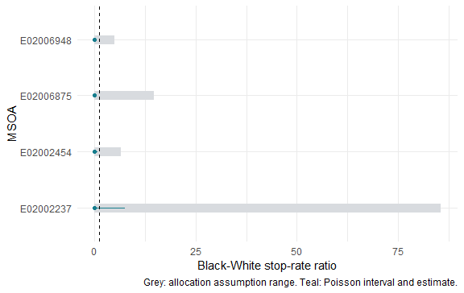

This vignette is precomputed from bundled public records, Census populations and
verified geography. Package checks need no network. The four example MSOAs are
the areas with the most records in the May-July 2026 West Yorkshire sample; this
selection illustrates methods and does not represent England and Wales.

## Events, reporting coverage and exposure

A stop is an event, not a unique person. A person may contribute several events.
No analysis creates a population-minus-stops cell. Self-defined ethnicity and
officer-defined ethnicity describe different measurements and remain separate.

`sl_counts()` keeps force and month as reporting strata. A submitted zero is
zero; an absent force-month is NA. Use `months` and `forces` to narrow the source
coverage grid explicitly. Filtering by an event characteristic does not change
the number of months during which those events could have been observed.
The `units` mapping supplies areas with no events, and the full sample includes
this mapping in its contract. Without one, the area universe is observed areas.

For population P and m submitted months, exposure E = P * m / 12 person-years.
The annualised event rate is 1,000 * n / E. `period_rate` is the separately named
rate n / P * 1,000 for the observed cell. Missing submission months contribute
neither events nor exposure time. Suspected partial submissions need scrutiny;
their recorded counts are not estimates of unreported events.


``` r
ratios <- sl_rate_ratio(rates)
knitr::kable(ratios[c("geography_code", "ratio", "conf_low", "conf_high",
  "n_reference", "n_comparison", "dispersion")], digits = 3)
```


|geography_code | ratio| conf_low| conf_high| n_reference| n_comparison| dispersion|
|:--------------|-----:|--------:|---------:|-----------:|------------:|----------:|
|E02002237      |     0|        0|     7.451|          18|            0|         NA|
|E02002454      |     0|        0|     0.761|          72|            0|         NA|
|E02006875      |     0|        0|     0.349|         196|            0|         NA|
|E02006948      |     0|        0|     0.138|          84|            0|         NA|


These are Black-White **stop-rate ratios**, not person-level probability ratios.
They come from a Poisson count model with a log exposure offset and ethnicity
indicator. Confidence intervals are exact conditional Poisson intervals.
Dispersion is a Pearson residual diagnostic, not a correction for denominator
or missing-ethnicity assumptions. With replicated cells, `method = "quasipoisson"`
estimates dispersion; `method = "negbin"` estimates extra count variation. Neither
turns residence into the population exposed to police activity.

## Missing ethnicity changes the estimand

Unknown ethnicity is kept in the numerator table and has no Census population
denominator. If R and C are the recorded reference and comparison counts and U
are Unknown events, extreme ratio bounds are

```
L = (C/E_C) / ((R+U)/E_R)
H = ((C+U)/E_C) / (R/E_R)
```

These bounds allocate every Unknown to one of the pair. Proportional allocation
uses all known ethnicity groups. MAR by force and object assumes missingness is
independent of ethnicity conditional on those variables; it cannot be evaluated
if object grouping has been discarded or a required stratum has no known records.
The tipping allocation assumes the fraction q of U goes to the comparison group
and the remainder goes to the reference. Values outside [0,1] cannot tip the ratio.


``` r
bounds <- sl_missing_ethnicity_bounds(counts, population)
knitr::kable(bounds[c("geography_code", "scenario", "ratio", "unknown",
  "lower_bound", "upper_bound", "tipping_allocation")], digits = 3)
```


|geography_code |scenario          |  ratio| unknown| lower_bound| upper_bound| tipping_allocation|
|:--------------|:-----------------|------:|-------:|-----------:|-----------:|------------------:|
|E02002237      |all_to_reference  |  0.000|      47|           0|      85.533|              0.041|
|E02002237      |all_to_comparison | 85.533|      47|           0|      85.533|              0.041|
|E02002237      |proportional      |  0.000|      47|           0|      85.533|              0.041|
|E02002237      |force_object_mar  |  0.000|      47|           0|      85.533|              0.041|
|E02002454      |all_to_reference  |  0.000|      32|           0|       6.438|              0.210|
|E02002454      |all_to_comparison |  6.438|      32|           0|       6.438|              0.210|
|E02002454      |proportional      |  0.000|      32|           0|       6.438|              0.210|
|E02002454      |force_object_mar  |  0.000|      32|           0|       6.438|              0.210|
|E02006875      |all_to_reference  |  0.000|     156|           0|      14.609|              0.117|
|E02006875      |all_to_comparison | 14.609|     156|           0|      14.609|              0.117|
|E02006875      |proportional      |  0.000|     156|           0|      14.609|              0.117|
|E02006875      |force_object_mar  |  0.000|     156|           0|      14.609|              0.117|
|E02006948      |all_to_reference  |  0.000|     131|           0|       4.805|              0.402|
|E02006948      |all_to_comparison |  4.805|     131|           0|       4.805|              0.402|
|E02006948      |proportional      |  0.000|     131|           0|       4.805|              0.402|
|E02006948      |force_object_mar  |  0.000|     131|           0|       4.805|              0.402|


Sampling uncertainty is conditional on a recorded-count model. The assumption
range asks what different allocations would imply. They are displayed separately
and are never combined into one interval.



## Denominator scenarios require comparable cells

Residence is one possible exposure definition. Workday, visitor and mobility
exposures require independent justification and compatible geography and ethnicity
definitions. There is no built-in workday exposure in version 0.1.0.
The example below deliberately doubles the Black exposure as a transparent
hypothetical scenario; it is not a measured mobility adjustment.


``` r
hypothetical <- as.data.frame(population)
hypothetical$population[hypothetical$ethnicity == "Black"] <-
  hypothetical$population[hypothetical$ethnicity == "Black"] * 2
hypothetical <- sl_exposure(hypothetical, geography = "msoa21",
  source = "Hypothetical double Black exposure; not measured data")
denominators <- sl_denominator_scenarios(counts,
  list(resident = population, hypothetical = hypothetical))
knitr::kable(denominators[c("geography_code", "scenario", "ratio",
  "conf_low", "conf_high", "lower_bound", "upper_bound")], digits = 3)
```


|geography_code |scenario     | ratio| conf_low| conf_high| lower_bound| upper_bound|
|:--------------|:------------|-----:|--------:|---------:|-----------:|-----------:|
|E02002237      |resident     |     0|        0|     7.451|           0|           0|
|E02002454      |resident     |     0|        0|     0.761|           0|           0|
|E02006875      |resident     |     0|        0|     0.349|           0|           0|
|E02006948      |resident     |     0|        0|     0.138|           0|           0|
|E02002237      |hypothetical |     0|        0|     3.725|           0|           0|
|E02002454      |hypothetical |     0|        0|     0.381|           0|           0|
|E02006875      |hypothetical |     0|        0|     0.174|           0|           0|
|E02006948      |hypothetical |     0|        0|     0.069|           0|           0|


## Direct age-sex standardisation

RM032 provides Census 2021 ethnicity by age and sex at MSOA and LSOA. Combining
published bands gives under 25, 25-34 and 35+, matching a common partition of
police age bands. Equating police-recorded gender with Census sex is an explicit
measurement assumption. Unknown age, gender and ethnicity appear in exclusion
diagnostics, rather than being recoded to a known category.

The same age-sex weights apply to every ethnicity group. For stratum h, weights
w_h sum to one and the standardised rate is 1,000 * sum_h w_h n_h/E_h. A stratum
with positive weight and zero exposure prevents direct standardisation. Sampling
intervals combine exact stratum Poisson intervals using a Bonferroni correction;
they are conservative and treat Census weights as fixed. Different Census
tables may differ slightly because of disclosure control.


``` r
demographic <- readRDS(data_file("example-demographic-counts.rds"))
crosstab <- readRDS(data_file("sample-crosstab.rds"))
standardised <- sl_standardise(demographic, crosstab)
knitr::kable(standardised[c("geography_code", "ethnicity", "crude_rate",
  "standardised_rate", "complete_strata", "excluded_events")], digits = 2)
```


|geography_code |ethnicity | crude_rate| standardised_rate|complete_strata | excluded_events|
|:--------------|:---------|----------:|-----------------:|:---------------|---------------:|
|E02002237      |Asian     |       4.69|              3.40|TRUE            |              47|
|E02002237      |Black     |       0.00|              0.00|TRUE            |              47|
|E02002237      |Mixed     |       0.00|              0.00|TRUE            |              47|
|E02002237      |Other     |      83.33|             67.65|TRUE            |              47|
|E02002237      |White     |      12.71|             12.95|TRUE            |              47|
|E02002454      |Asian     |       1.58|              1.19|TRUE            |              35|
|E02002454      |Black     |       0.00|              0.00|TRUE            |              35|
|E02002454      |Mixed     |       0.00|              0.00|TRUE            |              35|
|E02002454      |Other     |      12.94|             10.24|TRUE            |              35|
|E02002454      |White     |      48.12|             47.96|TRUE            |              35|
|E02006875      |Asian     |      12.63|             38.25|TRUE            |             167|
|E02006875      |Black     |       0.00|              0.00|TRUE            |             167|
|E02006875      |Mixed     |       0.00|              0.00|TRUE            |             167|
|E02006875      |Other     |      24.69|             12.77|TRUE            |             167|
|E02006875      |White     |     118.25|            163.29|TRUE            |             167|
|E02006948      |Asian     |       8.78|              7.61|TRUE            |             144|
|E02006948      |Black     |       0.00|              0.00|TRUE            |             144|
|E02006948      |Mixed     |       0.00|              0.00|TRUE            |             144|
|E02006948      |Other     |      39.80|             48.74|TRUE            |             144|
|E02006948      |White     |     181.60|            201.86|TRUE            |             144|


The test suite separately reproduces a worked two-age example. A group with
monthly counts 18 and 1 and populations 900 and 100 has an annual crude rate of
228 per 1,000. Equal standard weights give 180 per 1,000. These are different
population summaries; standardisation does not establish a causal disparity.

## Rankings need uncertainty, too


``` r
ranks <- sl_ranking_stability(ratios, n = 200, seed = 2026)
#> Error in `sl_abort()` at searchlight/R/sens-ranking.R:93:9:
#> ! Bootstrap needs positive groups and a count distribution.
knitr::kable(as.data.frame(ranks))
#> Error:
#> ! object 'ranks' not found
knitr::kable(attr(ranks, "pairwise"), digits = 3)
#> Error:
#> ! object 'ranks' not found
```

The bootstrap simulates counts from the fitted count models. A quasi-Poisson
fit does not define a sampling distribution and cannot be used for this
bootstrap. A zero observed group count makes a plug-in bootstrap degenerate;
use an appropriate posterior model for those cases. Draws where both group
counts are zero have no defined rate ratio and are reported as omitted.
Rank probabilities and pairwise ordering are conditional on the stated model,
population and recording assumptions. An apparent league table is not evidence
that every pair of areas differs.

## Validation and limits

Known-answer tests cover event counts exceeding population, missing months,
exact zero-count intervals, analytical allocation bounds and tipping shares,
direct standardisation, and rank probability sums. Public sample diagnostics
also flag missing coordinates and systematic snap-point proximity to boundaries.
These checks do not establish that a causal interpretation is appropriate.

Methods use the R Core [GLM documentation](https://stat.ethz.ch/R-manual/R-devel/library/stats/html/glm.html),
[exact Poisson test documentation](https://stat.ethz.ch/R-manual/R-devel/library/stats/html/poisson.test.html),
and [MASS negative-binomial documentation](https://stat.ethz.ch/R-manual/R-devel/library/MASS/html/glm.nb.html).
Source tables, licences and vintages are recorded in `inst/NOTES/data_sources.md`.
