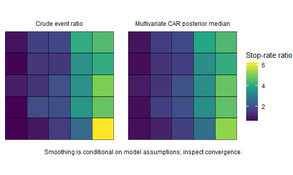
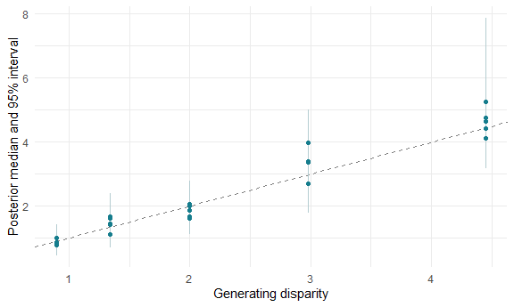
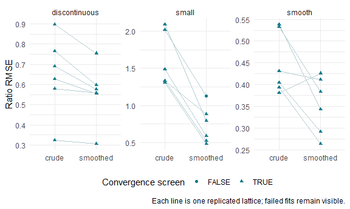

Small-area ratios are noisy when counts or comparison populations are small.
Spatial smoothing borrows information under a prior about neighbouring areas.
It can stabilise estimates, but cannot correct an inappropriate population
denominator, missing submissions, unknown ethnicity or anonymised snap points.
This vignette reports an explicitly limited, replicated simulation study rather
than treating smooth-looking maps as evidence of accuracy.

## A spatial model of disparity

`sl_spatial_disparity()` fits two Poisson responses using
`CARBayes::MVS.CARleroux`, with a separate population-time offset for each group.
Its linear predictor is

```
N_ig ~ Poisson(E_ig * theta_ig)
log(theta_ig) = alpha_g + phi_ig
log(disparity_i) = alpha_comparison - alpha_reference
                   + phi_i,comparison - phi_i,reference
```

The multivariate CAR prior allows spatial correlation and correlation between
group effects. For two groups it has an equivalent shared/contrast decomposition:
`u_i = (phi_ir + phi_ic)/2`, `v_ir = (phi_ir - phi_ic)/2`, `v_ic = -v_ir`.
Thus `phi_ig = u_i + v_ig` and the shared part cancels from disparity. These
components inherit the multivariate covariance; searchlight does not claim to fit
three separately identifiable independent spatial fields from two responses.
This differs fundamentally from assigning one shared spatial effect to both groups,
which would cancel and leave no local disparity surface.

Rook adjacency is the default. Islands require a justified explicit `adjacency`
matrix; they are never silently linked to a convenient neighbour. Unknown events
are counted in the output but excluded from the known-group likelihood. Areas
without usable exposure are listed separately. Missing months contribute no time.
Spatial models on records with many points near boundaries raise a warning.


``` r
simulation <- sl_simulate(side = 5, seed = 1301)
fit <- sl_spatial_disparity(simulation$counts, simulation$population,
  simulation$boundaries, burnin = 2000, n.sample = 12000, thin = 10,
  chains = 2, seed = 1351)
```

For a real analysis, inspect diagnostics and extend the chains when necessary.
The saved example uses the final run selected by the reproducible simulation
script. It retains 1,000 joint draws for compact offline demonstrations; its
diagnostics describe the full final chains.


``` r
settings <- attr(fit, "mcmc_settings")
settings[c("burnin", "n.sample", "thin", "chains", "seed")]
#> $burnin
#> [1] 2000
#>
#> $n.sample
#> [1] 12000
#>
#> $thin
#> [1] 10
#>
#> $chains
#> [1] 2
#>
#> $seed
#> [1] 1351
diagnostics <- attr(fit, "diagnostics")
knitr::kable(diagnostics, digits = 2)
```


|parameter        | rhat| ess_bulk| ess_tail|converged |
|:----------------|----:|--------:|--------:|:---------|
|SIM0001          |    1|   971.49|  1260.72|TRUE      |
|SIM0002          |    1|  1148.12|  1321.58|TRUE      |
|SIM0003          |    1|  1295.30|  1780.36|TRUE      |
|SIM0004          |    1|  1331.49|  1582.54|TRUE      |
|SIM0005          |    1|  1397.86|  1716.21|TRUE      |
|SIM0006          |    1|  1042.90|  1315.01|TRUE      |
|SIM0007          |    1|  1500.59|  1540.46|TRUE      |
|SIM0008          |    1|  1428.32|  1628.19|TRUE      |
|SIM0009          |    1|  1447.12|  1779.91|TRUE      |
|SIM0010          |    1|  1266.36|  1352.44|TRUE      |
|SIM0011          |    1|  1335.58|  1571.31|TRUE      |
|SIM0012          |    1|  1246.02|  1399.45|TRUE      |
|SIM0013          |    1|  1482.70|  1589.48|TRUE      |
|SIM0014          |    1|  1516.09|  1701.91|TRUE      |
|SIM0015          |    1|  1555.46|  1437.39|TRUE      |
|SIM0016          |    1|  1316.30|  1502.72|TRUE      |
|SIM0017          |    1|  1575.98|  1687.12|TRUE      |
|SIM0018          |    1|  1601.04|  1736.74|TRUE      |
|SIM0019          |    1|  1409.12|  1840.78|TRUE      |
|SIM0020          |    1|  1180.97|  1802.26|TRUE      |
|SIM0021          |    1|  1266.16|  1544.43|TRUE      |
|SIM0022          |    1|  1695.60|  1664.20|TRUE      |
|SIM0023          |    1|  1721.59|  1661.11|TRUE      |
|SIM0024          |    1|  1578.17|  1654.03|TRUE      |
|SIM0025          |    1|  1388.27|  1749.30|TRUE      |
|alpha_reference  |    1|  1273.71|  1276.21|TRUE      |
|alpha_comparison |    1|  1514.46|  1748.83|TRUE      |
|Sigma11          |    1|  1720.19|  1783.74|TRUE      |
|Sigma12          |    1|  2020.84|  1875.66|TRUE      |
|Sigma22          |    1|  1754.14|  1924.99|TRUE      |
|rho              |    1|  1813.22|  1814.69|TRUE      |


The convergence screen requires rank-normalised split R-hat at most 1.01 and
bulk and tail effective sample sizes at least 400 for all area log-ratios and
monitored global parameters. These are useful checks, not proof of convergence.
The short tests deliberately fail this screen and emit a warning; they test
implementation and rough recovery, not reliable production inference.



Both maps use the same colour scale. Intervals and exceedance probabilities,
rather than only posterior medians, are available for every area.


``` r
knitr::kable(head(as.data.frame(fit)[c("geography_code", "ratio",
  "credible_low_95", "credible_high_95", "probability_above_1",
  "probability_above_k")]), digits = 3)
```


|geography_code | ratio| credible_low_95| credible_high_95| probability_above_1| probability_above_k|
|:--------------|-----:|---------------:|----------------:|-------------------:|-------------------:|
|SIM0001        | 0.786|           0.441|            1.314|               0.183|               0.000|
|SIM0002        | 1.101|           0.689|            1.762|               0.655|               0.006|
|SIM0003        | 1.669|           1.110|            2.491|               0.992|               0.203|
|SIM0004        | 2.675|           1.776|            3.911|               1.000|               0.923|
|SIM0005        | 5.250|           3.686|            7.854|               1.000|               1.000|
|SIM0006        | 0.765|           0.470|            1.139|               0.106|               0.000|


``` r
ranks <- sl_ranking_stability(fit, "posterior", n = 500)
knitr::kable(head(as.data.frame(ranks)))
```


|geography_code | median_rank| rank_low| rank_high| effective_draws|method    |
|:--------------|-----------:|--------:|---------:|---------------:|:---------|
|SIM0001        |          23|       19|        25|             500|posterior |
|SIM0002        |          20|       14|        25|             500|posterior |
|SIM0003        |          15|       11|        20|             500|posterior |
|SIM0004        |          10|        6|        14|             500|posterior |
|SIM0005        |           2|        1|         6|             500|posterior |
|SIM0006        |          24|       20|        25|             500|posterior |


## Recovery independent of total intensity

The generator varies disparity east-west and expected total event intensity
north-south. Their correlation is zero on the lattice. Reference and comparison
rates are solved jointly to preserve that total intensity while changing disparity.
Recovering this pattern therefore tests the group-specific component, rather than
merely reproducing a map of all searches.



The full recovery test also checks that posterior ratios reconstructed from
group-specific spatial effects equal ratios reconstructed independently from
posterior fitted event means and exposures. This detects swapped area/group axes.

## Replicated evidence, including failure modes

`inst/scripts/simulation-study.R` runs three settings on 25-area lattices:
smooth variation, a sharp east-west discontinuity, and comparison populations
reduced from 1,000 to 50 per area. Each replicate generates fresh Poisson counts.
The study extends unsuccessful chains up to 80,000 iterations and retains any
remaining convergence failures in the output. No simulation chooses a seed based
on whether smoothing beats the crude estimator.


``` r
knitr::kable(summary, digits = 3)
```


|condition     |method   | replications| mean_rmse| mean_coverage| mean_rank_recovery| mcse_rmse| mcse_coverage| converged_fits|
|:-------------|:--------|------------:|---------:|-------------:|------------------:|---------:|-------------:|--------------:|
|discontinuous |crude    |            6|     0.647|         0.960|              0.849|     0.079|         0.025|              6|
|discontinuous |smoothed |            6|     0.558|         0.967|              0.849|     0.059|         0.012|              6|
|small         |crude    |            6|     1.592|         0.980|              0.669|     0.147|         0.014|              6|
|small         |smoothed |            6|     0.733|         0.993|              0.862|     0.102|         0.007|              5|
|smooth        |crude    |            6|     0.447|         0.993|              0.955|     0.029|         0.007|              6|
|smooth        |smoothed |            6|     0.353|         0.993|              0.976|     0.027|         0.007|              6|


RMSE measures error on the ratio scale. Coverage is the fraction of generating
area ratios in nominal 95% intervals, averaged over replicates. Rank recovery is
Spearman correlation; ties in a discontinuous truth surface remain ties. MCSE is
the standard deviation of replicate metrics divided by the square root of the
replication count. This small pilot does not establish general nominal coverage.
Rows with failed convergence must be inspected before substantive interpretation.
The table includes every attempted replicate. Metrics from failed chains, if
any, describe an unsuccessful fit and are not validated posterior inference.


``` r
failed <- replicates[replicates$method == "smoothed" & !replicates$converged,
  c("condition", "replicate", "seed", "model_iterations")]
knitr::kable(failed, caption = "Fits still failing the convergence screen at the iteration limit")
```


Table: Fits still failing the convergence screen at the iteration limit

|condition | replicate| seed| model_iterations|
|:---------|---------:|----:|----------------:|
|small     |         1| 1501|            80000|




Lower average RMSE does not mean every area improves. The following table reports
the fraction of individual area estimates with greater absolute error after
smoothing, and the signed average change in absolute error.


``` r
wide <- tidyr::pivot_wider(areas[c("condition", "replicate", "geography_code",
  "truth", "method", "estimate", "model_converged")],
  names_from = "method", values_from = "estimate")
wide$error_change <- abs(wide$smoothed - wide$truth) - abs(wide$crude - wide$truth)
harm <- dplyr::summarise(dplyr::group_by(wide, .data$condition, .data$model_converged),
  share_with_greater_error = mean(.data$error_change > 0),
  mean_absolute_error_change = mean(.data$error_change), .groups = "drop")
knitr::kable(harm, digits = 3)
```


|condition     |model_converged | share_with_greater_error| mean_absolute_error_change|
|:-------------|:---------------|------------------------:|--------------------------:|
|discontinuous |TRUE            |                    0.387|                     -0.043|
|small         |FALSE           |                    0.280|                     -0.605|
|small         |TRUE            |                    0.160|                     -0.681|
|smooth        |TRUE            |                    0.280|                     -0.071|


Neighbour borrowing can blur discontinuities; sparse populations can leave large
prior influence. The study quantifies performance only for these generators,
populations, priors and count sizes. It does not include location error, unmeasured
mobility, changing Census populations, repeated-person dependence or missing
submissions. Inspect unsmoothed counts, sensitivity bounds and convergence before
using a smoothed map, and report where the estimates become less accurate.

The model interface and covariance structure are documented in the
[CARBayes package and manual](https://CRAN.R-project.org/package=CARBayes)
and [Lee (2013)](https://www.jstatsoft.org/article/view/v055i13).
The [posterior diagnostic documentation](https://mc-stan.org/posterior/reference/rhat.html)
describes the convergence statistic used here.
